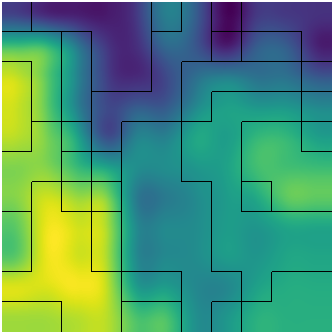
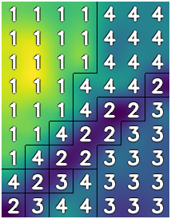

# Sensor Placement Problem (SPP) - Optimización con Hill Climbing
## Mis mas sinceros agradecimientos a Claude Sonnet por armar la documentación ###
Proyecto de optimización para el problema de ubicación de sensores en terrenos agrícolas, utilizando metaheurísticas de Hill Climbing con múltiples reinicios (Random Restart).

## 📋 Descripción del Problema

El objetivo es particionar un terreno en **p** zonas homogéneas, minimizando la varianza interna de cada zona mientras se mantienen restricciones de conectividad espacial. El algoritmo busca encontrar la mejor ubicación de sensores en un mapa bidimensional, considerando índices como NDVI (Normalized Difference Vegetation Index) u otros indicadores de humedad/calidad del terreno.

## 🎯 Características del Algoritmo

- **Solución Inicial**: Greedy espacial con semillas aleatorias
- **Optimización Local**: Hill Climbing con estrategia "First Improvement"
- **Estrategia Global**: Random Restart (20 iteraciones por defecto)
- **Penalizaciones**: 
  - Detección y penalización de islas (celdas aisladas de su zona)
  - Control de homogeneidad mediante umbral de varianza (α * Var(S))
- **Medición de Rendimiento**: Tiempo de ejecución y convergencia

## 🔧 Requisitos Previos

* **Compilador C++**: Compatible con C++17 o superior (ej. `g++ 7.0+`)
* **OpenCV 4**: Librerías de desarrollo para visualización
  ```bash
  # Ubuntu/Debian
  sudo apt-get install libopencv-dev
  
  # Arch Linux
  sudo pacman -S opencv
  ```
* **Python 3**: Para análisis de resultados (opcional)
  ```bash
  pip install pandas matplotlib seaborn
  ```

## ⚙️ Compilación

El proyecto incluye un `Makefile` para facilitar la compilación:

```bash
make
```

**Compilación manual** (alternativa):
```bash
g++ src/main.cpp src/heatmap.cpp -I/usr/include/opencv4 \
    -lopencv_core -lopencv_imgproc -lopencv_highgui -lopencv_imgcodecs \
    -o spp_solver
```

Para limpiar archivos generados:
```bash
make clean
```

## 🚀 Uso del Programa

### Ejecución Individual

```bash
./spp_solver <instancia.spp> <num_zonas> <alpha> [opciones]
```

**Parámetros:**
- `<instancia.spp>`: Ruta relativa desde `instances/` (ej. `Pequeñas/pequena_1.spp`)
- `<num_zonas>`: Número de zonas (p) a crear (sensores a ubicar)
- `<alpha>`: Factor de tolerancia para homogeneidad (0.0 - 1.0)
  - Menor α → zonas más homogéneas pero más fragmentadas
  - Mayor α → zonas más heterogéneas pero más compactas

**Opciones:**
- `--no-gui`: Ejecuta sin interfaz gráfica (útil para experimentos batch)
- `1` o `true` (4to parámetro): Muestra etiquetas numéricas de zonas en el heatmap

### Ejemplos

**Visualización estándar:**
```bash
./spp_solver Pequeñas/pequena_5.spp 10 0.9
```

**Con etiquetas de zona:**
```bash
./spp_solver Pequeñas/pequena_2.spp 4 0.25 true
```

**Modo batch (sin GUI):**
```bash
./spp_solver Medianas/mediana_1.spp 6 0.3 --no-gui
```

## 📊 Experimentación Automatizada

### Script de Ejecución Única (`run.sh`)

Ejecuta 10 repeticiones de un experimento y guarda estadísticas:

```bash
./run.sh <instancia.spp> <num_zonas> <alpha>
```

**Ejemplo:**
```bash
./run.sh Pequeñas/pequena_1.spp 5 0.4
```

Los resultados se guardan en:
```
test_results/resultados_<instancia>_z<zonas>_a<alpha>.txt
```

Cada archivo contiene:
```
<número_ejecuciones>
<costo_sin_penalización> <costo_con_penalización> <tiempo_segundos>
<costo_sin_penalización> <costo_con_penalización> <tiempo_segundos>
...
```

### Experimentos Masivos (`batch_run.sh`)

Script maestro para ejecutar múltiples configuraciones:

```bash
./batch_run.sh
```

**Configuración** (editar variables en el script):
```bash
INSTANCIAS=(
    "Pequeñas/pequena_1.spp"
    "Medianas/mediana_1.spp"
)
ZONAS_LISTA=(4 5 6)
ALPHAS_LISTA=(0.2 0.3 0.4 0.5)
```

Genera un grid completo de experimentos:
- Compila el proyecto automáticamente
- Ejecuta todas las combinaciones de instancia × zonas × alphas
- Guarda resultados organizados por carpetas
- Limpia archivos temporales al finalizar

## 📈 Análisis de Resultados

### Script de Visualización (`graph.py`)

Genera gráficos comparativos de costos y tiempos de ejecución:

```bash
python graph.py
```

**Salidas:**
- Gráficos individuales por instancia en `graficos/`
- CSV resumen: `resumen_experimentos_<tamaño>.csv`

**Gráficos generados:**
1. **Costo vs Zonas**: Varianza total por configuración de α
2. **Tiempo vs Zonas**: Rendimiento computacional

## 📁 Estructura del Proyecto

```
IA-EDA/
├── src/
│   ├── main.cpp          # Algoritmo principal (Hill Climbing)
│   └── heatmap.cpp       # Visualización con OpenCV
├── instances/            # Archivos de datos (.spp)
│   ├── Pequeñas/        # Mapas 50x50
│   ├── Medianas/        # Mapas 100x100
│   └── Grandes/         # Mapas 200x200
├── test_results/        # Salidas de experimentos
│   ├── resultados_Pequeñas/
│   └── resultados_Medianas/
├── graficos/            # Visualizaciones generadas
├── run.sh               # Experimento individual (10 runs)
├── batch_run.sh         # Experimentos masivos
├── graph.py             # Análisis y gráficos
└── Makefile             # Compilación automatizada
```

## 📄 Formato de Instancias (.spp)

```
<m> <n>
<valor_11> <valor_12> ... <valor_1n>
<valor_21> <valor_22> ... <valor_2n>
...
<valor_m1> <valor_m2> ... <valor_mn>
```

- Primera línea: dimensiones del mapa (filas × columnas)
- Siguientes líneas: valores flotantes del índice de calidad (ej. NDVI)

## 📊 Salida del Programa

```
Instancia cargada: 100x100
Varianza Total (Var(S)): 0.045823
  --> Nueva mejor solucion encontrada!
Mejor Costo Final (sin penalizacion): 0.012345
Mejor Costo Final (con penalizacion): 0.015678
Tiempo de ejecucion: 12.456 segundos
Mostrando mapa de calor...
```

## 🖼️ Ejemplos Visuales

### Ejemplo 1: Instancia Pequeña (10 zonas, α=0.9)
```bash
./spp_solver Pequeñas/pequena_5.spp 10 0.9 
```


### Ejemplo 2: Instancia con Etiquetas (4 zonas, α=0.25)
```bash
./spp_solver Pequeñas/pequena_2.spp 4 0.25 true
```


## 🛠️ Modificación de Parámetros

**Ajustar número de restarts** (en `main.cpp`, línea ~420):
```cpp
int num_restarts = 20; // Cambiar según necesidad
```

**Cambiar repeticiones por experimento** (en `run.sh`, línea 12):
```bash
NUM_EJECUCIONES=10  # Cambiar a 20 o 30 para mayor robustez
```

**Modificar factores de penalización** (en `main.cpp`, función `evaluar_solucion`):
```cpp
const double deterrant = 1e9;   // Penalización homogeneidad
const double M_ISLA = 5000.0;   // Penalización islas
```

## 🐛 Solución de Problemas

**Error: "No se pudo abrir el archivo"**
- Verificar que la ruta comience desde `instances/`
- Ejemplo correcto: `Pequeñas/pequena_1.spp`

**Error de compilación: "opencv4 not found"**
- Instalar: `sudo apt-get install libopencv-dev`
- Verificar ruta en Makefile: `-I/usr/include/opencv4`

**El programa no muestra ventanas gráficas**
- Verificar que no se use la flag `--no-gui`
- Asegurar que OpenCV esté correctamente instalado con soporte GUI

## 📝 Notas Técnicas

- El algoritmo converge típicamente en 5-15 restarts para instancias medianas
- Complejidad temporal: O(restarts × N × M × p × iteraciones_HC)
- La detección de islas mejora significativamente la compactación espacial
- El umbral de varianza (α) debe calibrarse según el tipo de terreno

## 👥 Autores

Proyecto desarrollado para el curso de Inteligencia Artificial - Algoritmos de Optimización

---

**Versión:** 2.0 (Noviembre 2025)
